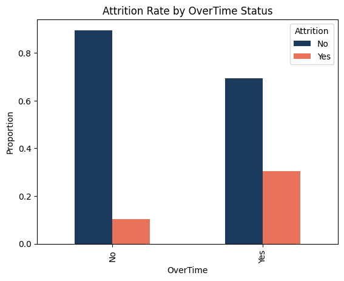
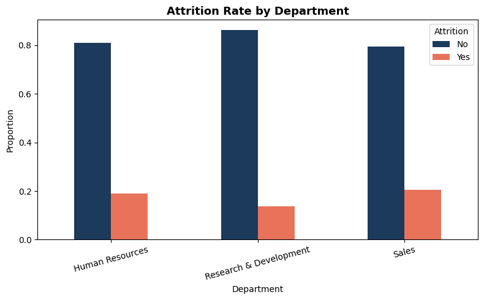
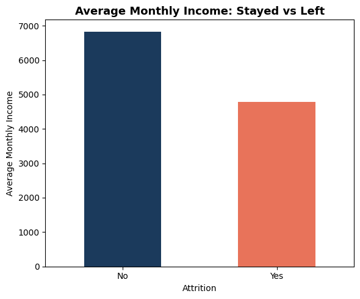
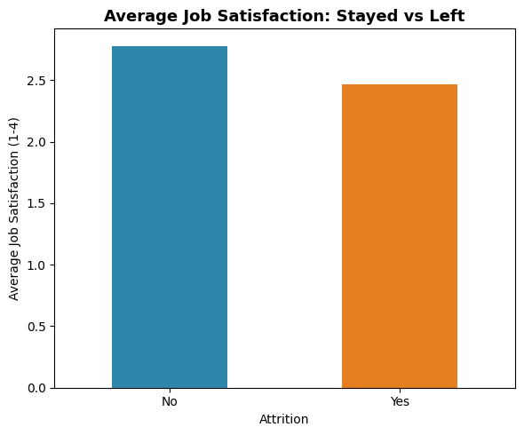

# HR Attrition Analysis & Prediction

Analysis of employee attrition patterns using the IBM HR Analytics dataset, 
with statistical testing and a predictive model to identify at-risk employees.

## Problem Statement
Employee attrition costs companies significant time and money in hiring and 
training. This project analyzes what factors drive attrition and builds a 
model to flag employees at higher risk of leaving.

## Project Structure
data/ - raw and processed datasets
notebooks/ - exploration, analysis, and modeling notebooks
scripts/ - automated data pipeline
outputs/ - charts and generated reports

## Tools Used
- Python (Pandas, NumPy, Matplotlib, Scikit-learn, SciPy)
- SQL (SQLite)
- Jupyter Notebook

## Key Steps
1. Data cleaning and preprocessing
2. Exploratory data analysis
3. Statistical hypothesis testing
4. Predictive model (Logistic Regression)
5. Automated reporting pipeline

## Key Findings
## Key Findings

**1. Overtime is the strongest predictor of attrition**
Employees who work overtime leave at nearly 3x the rate of those who don't 
(30.5% vs 10.4%).



**2. Sales and HR see higher attrition than R&D**
Sales (~20.6%) and HR (~19%) have noticeably higher attrition rates 
compared to Research & Development (~13.8%).



**3. Lower income correlates with higher attrition**
Employees who left had an average monthly income of ₹4,787 compared to 
₹6,833 for those who stayed.



**4. Job satisfaction has a smaller but present effect**
Employees who left reported slightly lower average job satisfaction 
(2.47 vs 2.78 on a 4-point scale) — a smaller gap than overtime or income.




## How to Run
```bash
pip install -r requirements.txt
jupyter notebook notebooks/01_exploration.ipynb
```

## Author
Your Name — [https://github.com/jeeny145]

